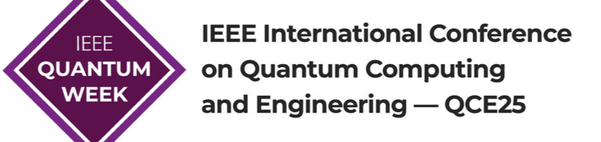

# Welcome to the Scalable Quantum Error Correction Workshop

### Organized as part of [IEEE Quantum Week (QCE 2025)](https://qce.quantum.ieee.org/2025/)
**Date: Tuesday, September 2, 2025**  
**Location: [Albuquerque Convention Center](https://albuquerquecc.com/)**

  

## Workshop Theme and Objectives

The goal of this workshop is to explore scalable quantum error correction techniques for fault-tolerant quantum computing. The event will feature invited talks from researchers and industry leaders at the forefront of this field, as well as a concluding panel discussion focused on identifying key open problems—both foundational and practical—in scaling QEC systems. We will also explore recent results and advances that bring us closer to building scalable and implementable quantum error correction.

## Schedule

| Time | Event |
|------|-------|
| 10:00 - 11:30 | Session 1: 3 Talks × 30 min each (including questions) |
| **11:30 - 13:00** | **Lunch Break** |
| 13:00 - 14:30 | Session 2: 3 Talks × 30 min each |
| **14:30 - 15:00** | **Break** |
| 15:00 - 15:30 | Session 3: 1 Talk × 30 min |
| 15:30 - 16:30 | Panel Discussion: Pathways to Scalable QEC |
| 16:30 - 17:00 | Open Q&A and Networking |

## Topics Covered

- Quantum error correction codes with scalability in mind
- Efficient decoding algorithms and implementations
- FTQC architectures for large-scale systems
- Logical operations and error rates at scale
- Design tradeoffs: overhead vs. performance
- Interplay between physical hardware constraints and QEC

## Tentative Invited Speakers

- Eddie Schoute or Patrick Rall (IBM)
- Earl Campbell (Riverlane)
- John Robinson (QuEra)

- Sunny He (MIT)
- Chris Pattison (UC Berkeley)
- Dolev Bluvstein (Harvard)

## Important Date

- **Workshop date:** Tuesday, September 2, 2025 (10 am - 5 pm)

## Organizers / Program Chairs

- Madelyn Cain
- Nithin Raveendran
- Valentin Savin
- Bane Vasić
- Qian Xu

## Contact

Questions? Please contact [nithin@arizona.edu](mailto:nithin@arizona.edu)

---

*Webpage last updated: Aug 8, 2025*